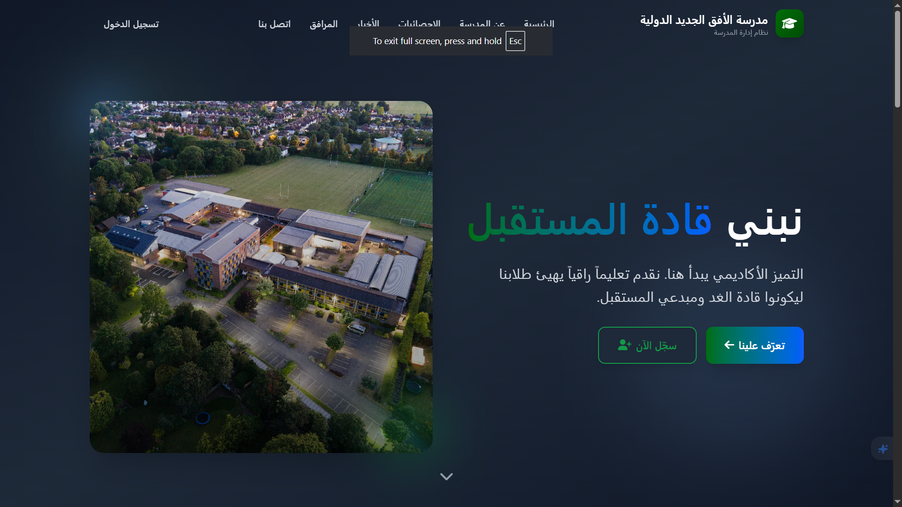
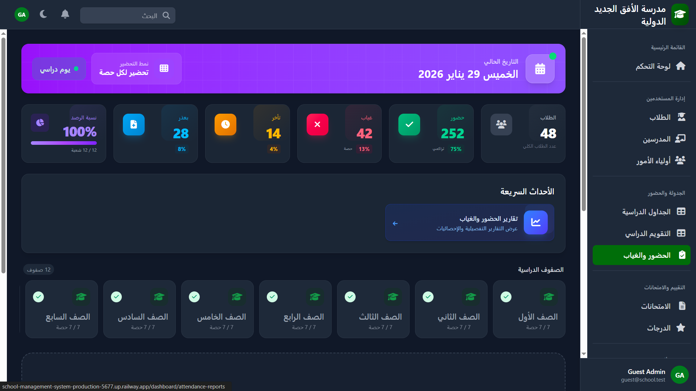
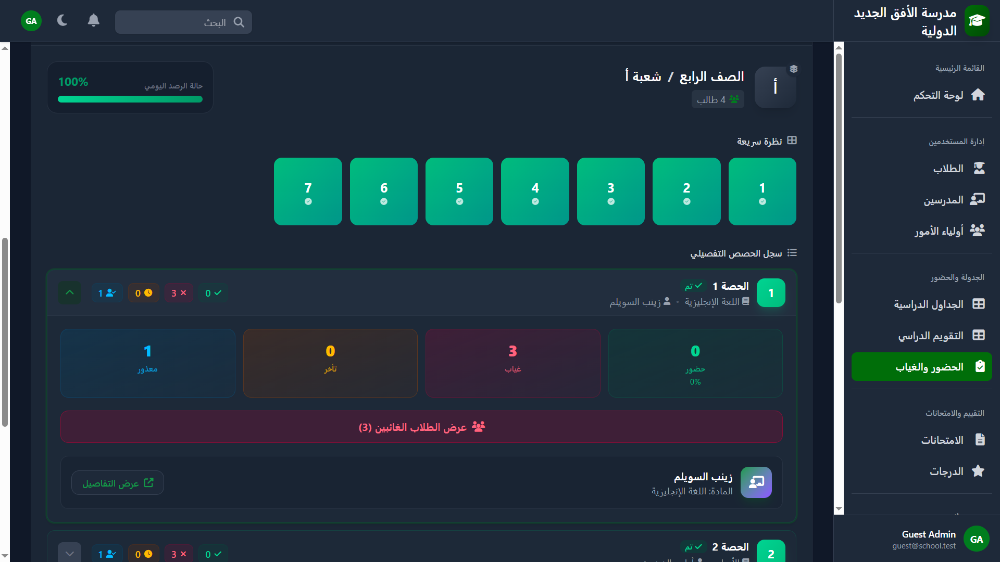
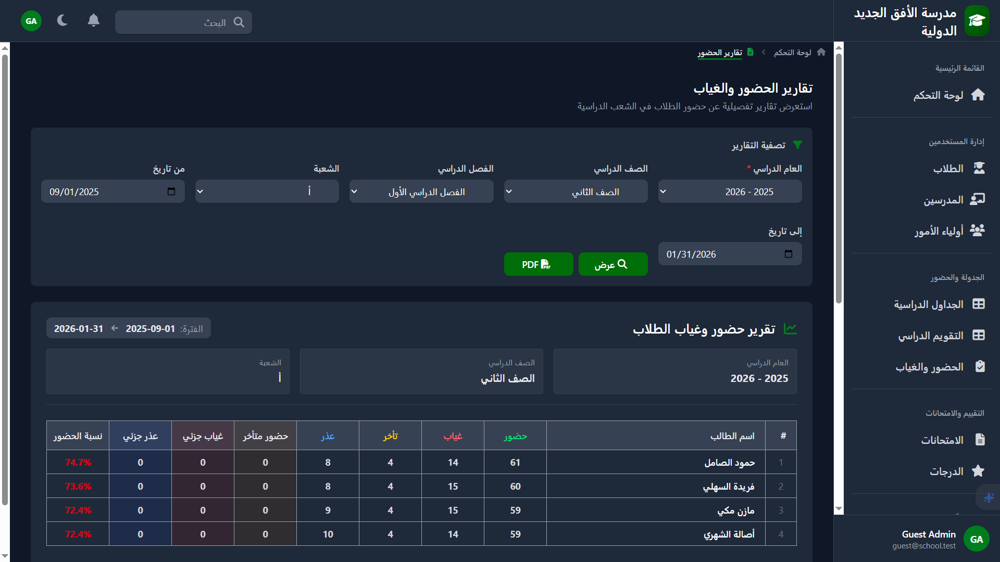
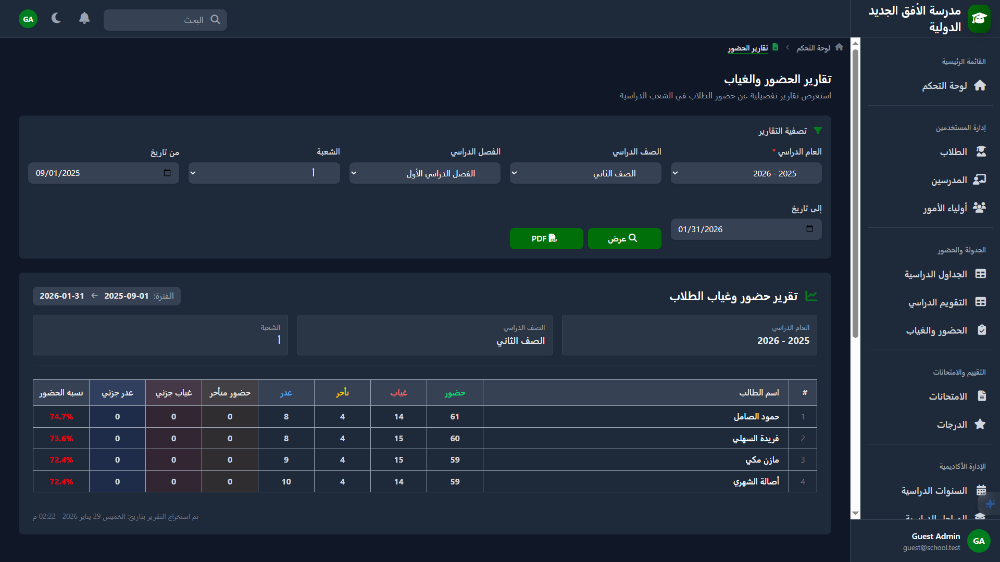
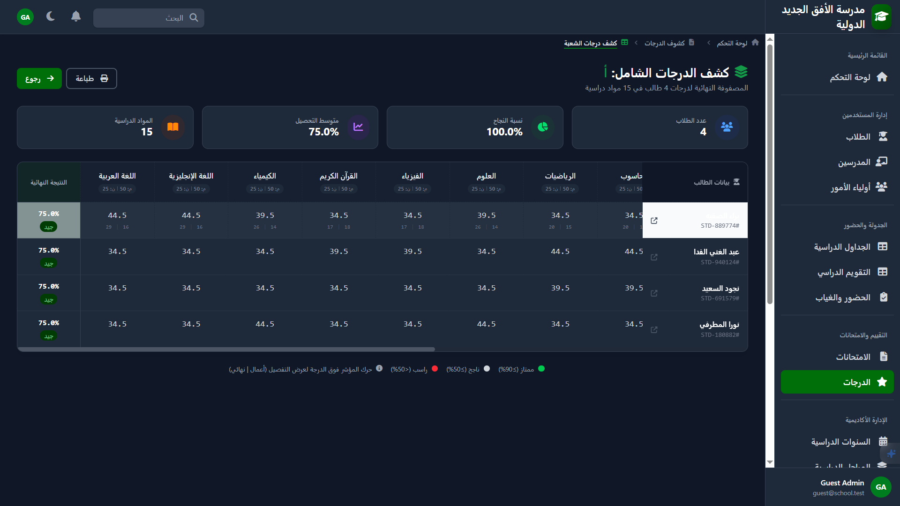
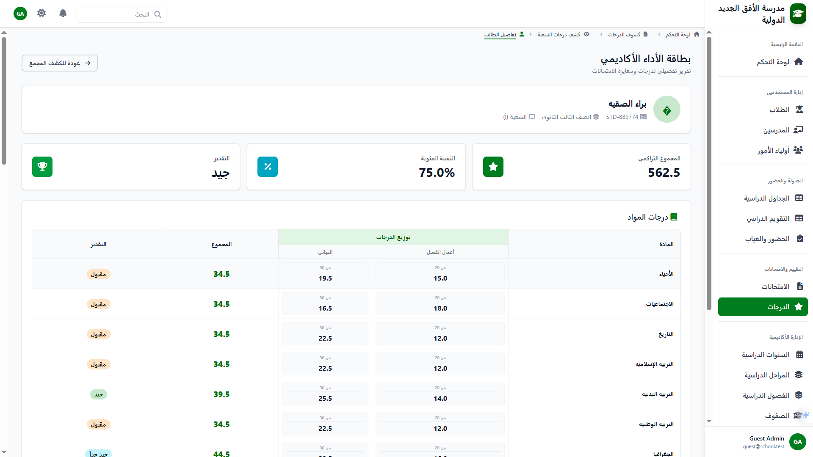

# Integrated School Management System (ISMS)

<p align="center">
  <a href="https://school-management-system-production-5677.up.railway.app/">
    
  </a>
</p>

<p align="center">
  
  
  
  
</p>

A web-based, role-aware School Management System built with **Laravel 12**, **Blade**, **Livewire**, **Alpine.js**, and **Tailwind CSS 4**.

This repository showcases a modular, service-oriented Laravel codebase (admin dashboard + portals) with robust academic operations: **timetables**, **attendance**, **examinations**, **marksheets**, **reports**, and **notifications**.

---


---

## Screenshots

<div align="center">

| | | |
|:-------------------------:|:-------------------------:|:-------------------------:|
|  |  |  |
|  |  |  |
|  |  |  |
|  |  |  |
|  | | |

</div>

---

## Highlights

- **Role-based access control** using Spatie Permissions (Admin / Teacher / Student / Guardian)
- **Livewire-first UI** for interactive admin workflows (wizards, tables, dashboards)
- **Multiple attendance modes**
  - Daily
  - Per-period
  - Split-day (AM/PM)
- **Grading rules & marksheets** (section-level grading configurations and audit views)
- **Portals** for Student / Teacher / Guardian with profile views and academic insights
- **Reporting**
  - Attendance reports (including PDF generation)
  - Activity log and change history visualization
- **Test suite** using Pest

## Main Modules

- **Academics**: academic years, terms, stages, grades, sections
- **Users**: users + linked profiles (students, teachers, guardians), roles & permissions
- **Curriculums**: curriculums per (year/term/grade) + subjects
- **Teacher assignments**: teacher-to-subject-to-section
- **Timetables**: settings, weekly schedules, slots builder
- **Attendance**: school days, sheets, student attendance records, dashboards & reports
- **Examinations**: exam types, exams, marks, grading rules, marksheets
- **Portals**: student/teacher/guardian dashboards and profile screens
- **Notifications**: in-app notifications and welcome emails

## Tech Stack

| Layer | Technologies |
|-------|--------------|
| **Runtime** | PHP 8.4+ |
| **Backend** | Laravel 12, Livewire 3 |
| **Frontend** | Blade, Alpine.js 3, Tailwind CSS 4, Vite 7 |
| **Auth** | Laravel Breeze 2 |
| **Authorization** | Spatie Laravel Permission 6 |
| **Key packages** | Spatie Activity Log, Spatie PDF, Predis (Redis), Sushi |
| **Build / assets** | Vite 7, Laravel Vite Plugin, PostCSS, Autoprefixer |
| **UI extras** | Chart.js, SweetAlert2, Sonner, @tailwindcss/forms |
| **Testing** | Pest 4 |
| **Tooling** | Laravel Pint, Laravel Telescope, Laravel Pail, Laravel Sail |


## Quickstart (Local)

### Requirements

- PHP 8.4+ (project targets Laravel 12)
- Composer
- Node.js + npm

### Setup

```bash
cp .env.example .env
composer install
php artisan key:generate
php artisan migrate
npm install
npm run build
```

### Run (Dev)

You can use the provided composer script (runs server, queue, logs, and Vite):

```bash
composer run dev
```

## Tests

```bash
composer run test
```

